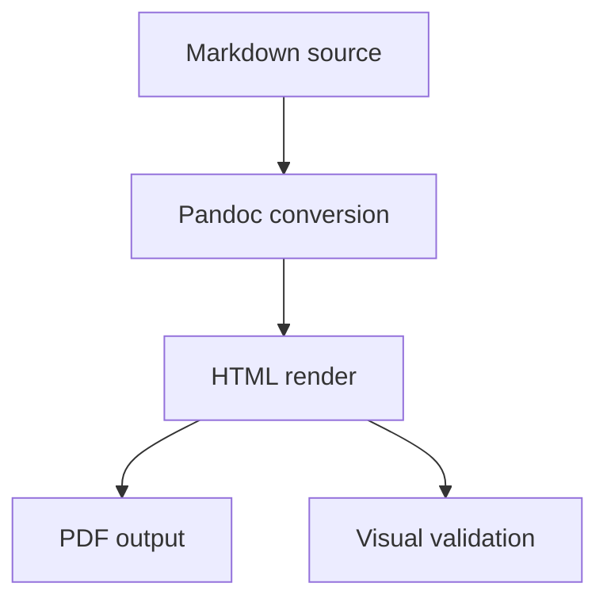
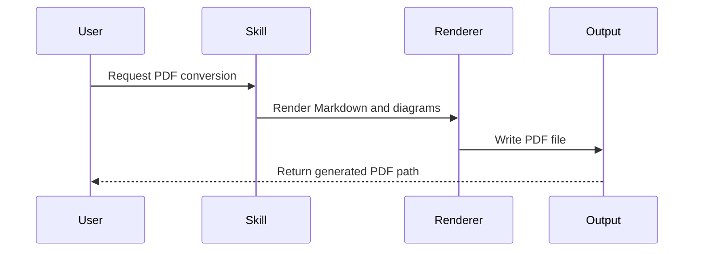

# Image and Mermaid Rendering Test

This document is a focused fixture for validating local image rendering and Mermaid diagram rendering in Markdown-to-PDF conversion.

## Local Image

The image below uses a relative path to a fixture asset.

## Mermaid Flowchart

## Mermaid Sequence Diagram

## Verification Notes

Expected output:

| Check | Expected Result |
|-------|-----------------|
| Local image | The sample SVG is visible in the generated PDF. |
| Flowchart | The Mermaid flowchart renders as a diagram, not as raw code. |
| Sequence diagram | The Mermaid sequence diagram renders as a diagram, not as raw code. |

