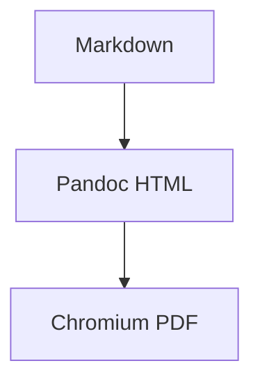

# Executive Summary

This report validates metadata, table of contents, LaTeX math, Mermaid diagrams, local assets, and long tables.

## Math

Inline math uses $a^2 + b^2 = c^2$ and display math uses:

$$
\frac{a}{b} = c
$$

## Mermaid Diagram

## Long Table

| Row | Description | Status |
|-----|-------------|--------|
| 1 | Validation row with enough text to exercise wrapping behavior in generated PDF output. | OK |
| 2 | Validation row with enough text to exercise wrapping behavior in generated PDF output. | OK |
| 3 | Validation row with enough text to exercise wrapping behavior in generated PDF output. | OK |
| 4 | Validation row with enough text to exercise wrapping behavior in generated PDF output. | OK |
| 5 | Validation row with enough text to exercise wrapping behavior in generated PDF output. | OK |
| 6 | Validation row with enough text to exercise wrapping behavior in generated PDF output. | OK |
| 7 | Validation row with enough text to exercise wrapping behavior in generated PDF output. | OK |
| 8 | Validation row with enough text to exercise wrapping behavior in generated PDF output. | OK |
| 9 | Validation row with enough text to exercise wrapping behavior in generated PDF output. | OK |
| 10 | Validation row with enough text to exercise wrapping behavior in generated PDF output. | OK |
| 11 | Validation row with enough text to exercise wrapping behavior in generated PDF output. | OK |
| 12 | Validation row with enough text to exercise wrapping behavior in generated PDF output. | OK |
| 13 | Validation row with enough text to exercise wrapping behavior in generated PDF output. | OK |
| 14 | Validation row with enough text to exercise wrapping behavior in generated PDF output. | OK |
| 15 | Validation row with enough text to exercise wrapping behavior in generated PDF output. | OK |
| 16 | Validation row with enough text to exercise wrapping behavior in generated PDF output. | OK |
| 17 | Validation row with enough text to exercise wrapping behavior in generated PDF output. | OK |
| 18 | Validation row with enough text to exercise wrapping behavior in generated PDF output. | OK |
| 19 | Validation row with enough text to exercise wrapping behavior in generated PDF output. | OK |
| 20 | Validation row with enough text to exercise wrapping behavior in generated PDF output. | OK |
| 21 | Validation row with enough text to exercise wrapping behavior in generated PDF output. | OK |
| 22 | Validation row with enough text to exercise wrapping behavior in generated PDF output. | OK |
| 23 | Validation row with enough text to exercise wrapping behavior in generated PDF output. | OK |
| 24 | Validation row with enough text to exercise wrapping behavior in generated PDF output. | OK |
| 25 | Validation row with enough text to exercise wrapping behavior in generated PDF output. | OK |
| 26 | Validation row with enough text to exercise wrapping behavior in generated PDF output. | OK |
| 27 | Validation row with enough text to exercise wrapping behavior in generated PDF output. | OK |
| 28 | Validation row with enough text to exercise wrapping behavior in generated PDF output. | OK |
| 29 | Validation row with enough text to exercise wrapping behavior in generated PDF output. | OK |
| 30 | Validation row with enough text to exercise wrapping behavior in generated PDF output. | OK |

## Closing

All major sections should appear in the generated PDF.
